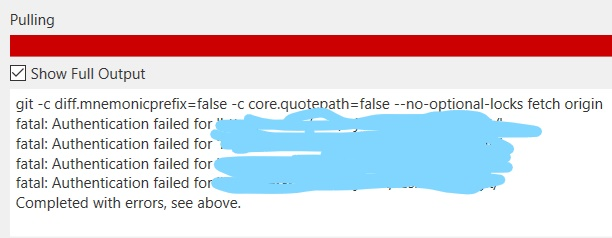

I know I shouldn't feel incompetent every time I struggle with some kind of error or bug; dealing with frustration comes with being a developer, and I chose this. This issue, however, frustrated me more than I care to admit.

This week I had to change the password on my work PC. Something I believe I have done many times before with no consequences.

A few days later I wanted to push some code in Sourcetree. Before commiting my changes I needed to do a pull. When I did so, I got the following error:

"fatal: Authentication failed for ...", plus a message from git at the top.

Seeing "authentication" made me think it was probably due to changing my password. I logged into our remote Bitbucket server with the new password. That worked fine. I came back to Sourcetree. Same error occured. I exited and reopened the program. Same error when I try to pull. 

I started asking coworkers and searching online for solutions. There was actually a solution on the [Atlassian community forum](https://community.atlassian.com/t5/Sourcetree-questions/Getting-quot-fatal-Authentication-failed-for-quot-error/qaq-p/624663) that involved navigating from C: -> User -> [myusername] -> AppData -> Local -> Atlassian -> Sourcetree and finding the "passwd" file, and deleting it. You should then be prompted to input your updated password. Great!

I got stuck on "AppData" which was conveniently not showing up in the folder where I was expecting it. I figured this was because I was using a work PC, and I didn't have this folder, or perhaps lacked proper permissions. I kept looking for other solutions, getting suggestions from coworkers, and nothing worked.

A coworker also suggested the above solution. Once again I could not find the AppData file.  This time, though, I decided to just search for "passwd" in the search bar for C drive. And the file showed up with the file path shown above. For whatever reason I couldn't see it in the other view in file explorer.

I deleted this file and tried to pull again. A modal popped up asking for my new password. This time the pull worked, no errors. Of course it did.

I don't think there is a moral to this story. I'll just use this post in the future as instructions for when I inevitably deal with this error again.

Yeah, let's just go with that.